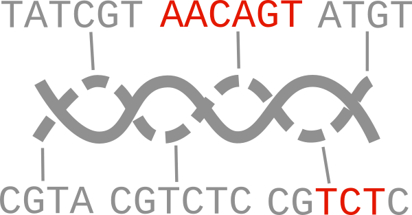

<p align="center">

</p>

# Ediacara


[](https://github.com/Edinburgh-Genome-Foundry/Ediacara/actions/workflows/build.yml)

Ediacara helps interpreting sequencing data of assembled DNA constructs (plasmids). It's used in the [Sequeduct pipeline](https://github.com/Edinburgh-Genome-Foundry/Sequeduct/).

## Install

```bash
# pip install ediacara
pip install --upgrade git+https://github.com/Edinburgh-Genome-Foundry/Ediacara.git@main
```

The plotting feature requires NCBI BLAST+. On Ubuntu, install it with:

```bash
apt-get install ncbi-blast+
```

## Usage

Using Ediacara requires the plasmid reference sequences (Genbank), the alignments in [PAF format](https://lh3.github.io/minimap2/minimap2.html#10), and a TSV file of coverage (depth) counts. Optionally, the user can also specify consensus (or *de novo* assembly) files that will be compared with the references.

[Minimap2](https://lh3.github.io/minimap2/) can create SAM or PAF alignments from fastq and reference fasta files.
[`paftools.js`](https://github.com/lh3/minimap2/blob/master/misc/README.md) can convert from SAM to PAF.
The TSV file is the output of `samtools depth -aa`.

[Canu](https://canu.readthedocs.io) can create an assembly file from filtered FASTQ reads that align best to the reference.

If we don't have sequencing data, [Badread](https://github.com/rrwick/Badread) can be used to simulate fastq files from reference sequences.

An example for creating alignments in the terminal, for a reference named `ABC_1`:

```bash
# badread simulate --reference ABC_1.fa --quantity 100x --length 5000,500 > ABC_1.fastq
minimap2 -a ABC_1.fa ABC_1.fastq > ABC_1.sam
samtools sort -O sam -T sample.sort -o ABC_1_sorted.sam ABC_1.sam
samtools depth -aa ABC_1_sorted.sam > ABC_1.tsv
paftools.js sam2paf ABC_1.sam > ABC_1.paf
```

Create a *de novo* assembly with Canu:

```bash
./canu-2.1.1/bin/canu -p egf -d ABC_1 genomeSize=8k -nanopore filtered_fastq/ABC_1_filtered.fastq
```

Create a PDF report in Python with Ediacara:

```python
import ediacara as edi
import dnacauldron  # for loading sequence files

tsv_file = "/path/to/ABC_1.tsv"
tsv = edi.ComparatorGroup.load_tsv(tsv_file)
paf_path = "/path/to/ABC_1.paf"
paf = edi.ComparatorGroup.load_paf(paf_path)
reference_paths = ["/path/to/ABC_1.gb"]
records = dnacauldron.biotools.load_records_from_files(files=reference_paths, use_file_names_as_ids=True)

references = {record.id: record for record in records}
alignments = {"paf": paf, "tsv": tsv}
comparator_group = edi.ComparatorGroup(references, alignments)

assembly_paths = {"ABC_1": "/path/to/canu_assembly/ABC_1/egf.contigs.fasta"}
comparator_group.perform_all_comparisons(assembly_paths=assembly_paths)
# Write a PDF report on all constructs:
edi.write_comparatorgroup_report("report_ABC.pdf", comparator_group)
```

If we want to investigate which of the parts are in the construct, we can align the part sequences
against the consensus or de novo sequence and create PDF report:

```python
assembly = edi.Assembly(
    assembly_path="/path/to/canu_assembly/ABC_1/egf.contigs.fasta",
    reference_path="/path/to/ABC_1.gb",
    alignment_path="/path/to/ABC_1_part_alignment.paf",
    assembly_plan=assembly_plan,
)

assemblybatch = edi.AssemblyBatch(assemblies=[assembly], name="EGF review")
assemblybatch.perform_all_interpretations_in_group()

edi.write_assembly_analysis_report("review_report_pdf", assemblybatch)
```

## Versioning

Ediacara uses the [semantic versioning](https://semver.org) scheme.

## Copyright

Copyright 2021 Edinburgh Genome Foundry

Ediacara was written at the [Edinburgh Genome Foundry](https://edinburgh-genome-foundry.github.io/)
by [Peter Vegh](https://github.com/veghp).
